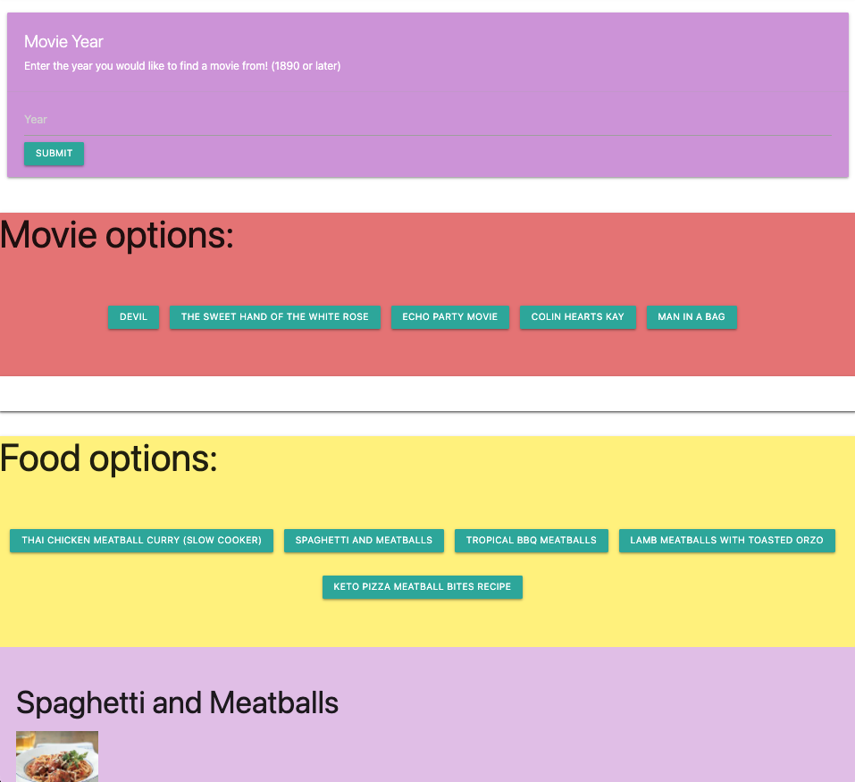

# View and Dine Randomizer

Deployed App: [View and Dine Randomizer](https://kcbryan10.github.io/View-Dine-Randomizer)

## Features

- Get a random selection of movies by year
- Get a random selection of foods
- View information about a movie or food dish by clicking on their respective button
  - Movie Info
    - Year released
    - Poster image
    - Overview
  - Food Info
    - Food image
    - Ingredients
    - Link to recipe insctructions
- Save favorites for later reference

## APIs

Movies: [TMDB API](https://developers.themoviedb.org/3/getting-started/introduction)  
Foods: [Edamam API](https://developer.edamam.com)
